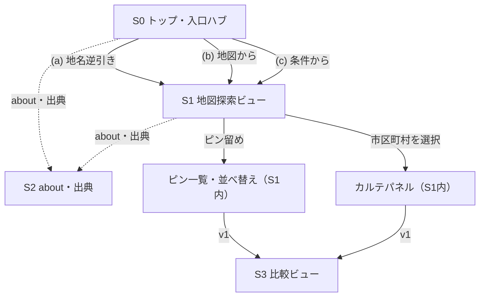

# 画面・機能・遷移（UX/情報設計の柱）

> **叩き台（2026-06-26）。** 段1で「機能一覧・画面一覧・画面遷移・トップページ」が単一の見取り図として無かった反省（`ADR-0025`）を受け、**外→内レンズ（ユーザー導線→画面→機能）**で起こす。視覚＝`DESIGN.md`、価値・スコープ＝`docs/01`、データ/API＝`docs/02`、決め事＝`docs/99`。全量マップの **E2** に対応。
> 粒度は「周辺＝薄く」＝**詳細モックは作らない**。一覧・遷移・画面別スコープまで。確定したものは `docs/99` 確定索引へ、未決は `docs/99` 保留へ送る。

---

## 1. 起点（外→内）— トップ＝「何起点で探すか」の入口ハブ

ユーザーは探し方の起点が分かれる（`docs/01`§3 の「広く探す→ピン→比較」）。**トップページはこの起点を束ねて選ばせる**（地図そのものを home にはしない）。

| 起点 | 入口 | 行き先 |
|---|---|---|
| (a) 地名から逆引き | 都県・市区町村名で探す | そのエリアを選択状態にした地図探索（→カルテ） |
| (b) 地図から | 地図を直接動かして選ぶ | 地図探索（クリックでカルテ） |
| (c) 条件から | 指標・有無で条件指定 | 条件を満たすエリアを地図にハイライト＋一覧 |
| (将来) おすすめ | 重みづけ（v2） | 候補提示 |

トップにはこの3起点＋**メニューバー（ナビ）**＋**関連リンク（出典・利用上の注意・about）**＋（あれば）**ピン留め済みエリアへの再訪導線**。

**既定の起点＝地図（b）**（地図が先に出来ており、(a)(c) も最終的に地図にリンクするため）。ただし**厳密な優先順位は設けない**（起点はユーザーが選ぶ）。

---

## 2. 機能一覧

**MVP**
- **F1 地図探索**：面塗り（市区町村を指標で色分け）＋塗り絵（生レイヤー重ね）＋レイヤー切替＋凡例（`ADR-0005/0006`）
- **F2 分野・指標の切替**：災害／利便／相場／将来／教育（`ADR-0006〜0010`）
- **F3 条件で絞り込み**：市区町村の数値・件数・有無に条件（重みづけしない・`ADR-0012`）＝起点(c)
- **F4 地名で逆引き**：都県・市区町村名→該当エリア＝起点(a)
- **F5 エリアカルテ**：選択した市区町村の詳細パネル（`ADR-0011`）
- **F6 ピン留め**：localStorage（`ADR-0012/0013`）
- **F7 並べ替え一覧表**：指標で街を並べ替え（`ADR-0012`）
- **F8 出典表示**：常時（MLIT／国土地理院・`ADR-0011`・法的要件）
- **F9 ナビ／メニュー・about・利用上の注意**
- 横断：空／読込／エラー状態、尺度（ズーム・スケール）表示

**v1**：F10 比較ビュー（ピン横並び・カルテ骨組み再利用・`ADR-0012`）／F11 メッシュ粒度（`ADR-0015`）／F12 端末またぎ保存（要：認証の要否＝下記未決）
**v2**：F13 おすすめ（説明できる重みづけ）

---

## 3. 画面一覧

| ID | 画面 | 内包・役割 | フェーズ |
|---|---|---|---|
| **S0** | トップ（入口ハブ） | 起点(a)(b)(c)＋ナビ＋関連リンク＋ピン再訪 | MVP |
| **S1** | 地図探索ビュー | ③開閉式（`DESIGN`§2）。F1〜F7 を**パネル/オーバーレイで内包（暫定）**。※パネル内包か別ページ遷移かは**画面表示イメージ次第＝§8 未決** | MVP |
| └ | （S1内）絞り込みパネル | F3 | MVP |
| └ | （S1内）レイヤー/凡例 | F1/F2 | MVP |
| └ | （S1内）カルテパネル | F5 | MVP |
| └ | （S1内）ピン一覧／並べ替え | F6/F7 | MVP |
| **S2** | about／出典／利用上の注意 | F8/F9（モーダル想定） | MVP |
| **S3** | 比較ビュー | F10（横並び・カルテ骨組み再利用） | v1 |

横断状態：各画面の空／読込／エラー（本格的な欠損UIは別バックログ）。

---

## 4. 画面遷移（叩き台）

- **（パネル内包を採る場合）S1 の内部はパネル開閉＝“状態”であって画面遷移ではない**（`DESIGN`§2の「出し入れ」）。**別ページ遷移を採るなら本遷移図と状態設計を見直す**（§8 未決・画面表示イメージ次第）。
- 共有リンク（URL状態）は将来（`ADR-0018` 保留）。MVPは画面間の素朴な遷移＋S1内状態。

---

## 5. 画面・機能別のロードマップ（フェーズ割付）

| フェーズ | 画面 | 機能 |
|---|---|---|
| **MVP** | S0 トップ・S1 地図探索・S2 about/出典 | F1〜F9＋横断状態・尺度表示 |
| **v1** | S3 比較ビュー | F10 比較・F11 メッシュ・F12 端末またぎ保存 |
| **v2** | （S0 に入口） | F13 おすすめ |

`docs/01`§6 のフェーズ（体験レベル）を、画面・機能の粒度に分解したもの。

---

## 6. 内→外クロスチェック（各画面が要るデータ/API）

二レンズの片側（内→外）。「画面に必要なデータ/APIが揃っているか」を照合する。

| 画面・機能 | 必要なデータ/API | 状態 |
|---|---|---|
| S1 面塗り（形） | `GET /api/choropleth/geometry`（`ST_AsGeoJSON`・4326） | ✅ 実装済（段1） |
| S1 面塗り（値） | `GET /api/choropleth/values?metric=`＋`setFeatureState`（`ADR-0016`） | 🔲 次スライス |
| S1 塗り絵（生レイヤー） | レイヤー別の生データ配信（点/線/面） | 🔲 |
| F4 地名逆引き | `admin_unit.name`/`code`（既存テーブルで可・検索クエリ） | 🔲（データは有） |
| F3 絞り込み | 市区町村×指標の集計（`metric_value`縦持ち・`ADR-0015`） | 🔲 |
| F5 カルテ | カルテ用 API（分野横断の集計・`ADR-0011`） | 🔲 |
| F6 ピン | localStorage（FEのみ・`ADR-0018` persist） | 🔲 |

→ 外→内（本書1〜5）と内→外（本表）の両方が揃って初めて「漏れていない」と言える（`docs/04`§8）。

---

## 7. 着手順（縦スライス）— 正は `docs/99`「実装スライス」

**順序（作業の待ち行列）の正は `docs/99`「実装スライス」**（本書は完成形の参照地図ゆえ順序を持たない＝二重管理しない）。各スライスは本書の F#・S# を辿り先に持つ。
現在地：段1（区の輪郭描画）＝✅済／**次＝指標1つの面塗り**（F1・F2／S1）。「データ→表示」規律（`docs/01`§7）＋着手時に小ゲート（`docs/04`§8）。

---

## 8. 未決・要検討と振り分け（叩き台ゆえ）

| 項目 | 振り分け | メモ／トリガー |
|---|---|---|
| 起点の既定・優先 | **今決定** | 既定＝地図(b)・厳密な優先なし（§1 反映済） |
| **S1 の内部構成（パネル内包 vs 別ページ遷移）** | **保留→`docs/99`** | **画面表示イメージ次第**。別ページなら §4 遷移図・状態設計を再考。トリガー＝S1実装着手時に軽い画面イメージを作って判断 |
| カルテの置き方 | 保留（S1構成に従属） | 上の S1 構成と一体で決める |
| トップ S0 の具体構成・レイアウト | 保留→`docs/99` | S0実装／UI設計時 |
| 端末またぎ保存（F12）と認証 | 保留（既存） | v1着手時。`ADR-0013`＝MVP認証なし・v1端末またぎ |
| ナビ／メニュー項目 | 保留→`docs/99` | S0／UI設計時 |
| 比較ビュー S3 の具体形 | 保留（既存） | v1。骨組みは `ADR-0012` で決定済 |
| 共有リンク（URL状態） | 保留（既存） | `ADR-0018` のまま・v1以降 |

> 「保留→`docs/99`」の新規項目（S1 内部構成・S0 構成・ナビ）は **`docs/99` 保留へ登録済み**（トリガー＝S1/S0 実装着手時）。
