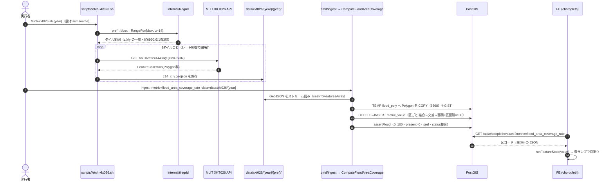

# 洪水の該当面積率 — 機能設計（レビュー用・#74）

> **ねらい**：レビューできる設計図。要件→処理フロー→モジュール/関数の責務→データ変換→要件との対応→レビュー観点 を一本の線でつなぎ、実装後にコードと突き合わせて「要件を満たすか（ホワイトボックス）」「挙動は正しいか（ブラックボックス）」を確認できるようにする。用語・概念は姉妹 note [`2026-07-05-disaster-area-rate-etl.md`](./2026-07-05-disaster-area-rate-etl.md) を参照（EPSG:6668・geom・タイル・交差・結合 等の意味はそちら）。設計根拠＝`ADR-0006`/`ADR-0015`/`ADR-0014`/`ADR-0032`/`ADR-0030`。既存実装の踏襲元＝`internal/ingest/metric_land_price.go`（空間結合）・`metric_area.go`（geography 面積）・`metric_pop_change.go`（GeoJSON ストリーム）。

---

## 0. 要件 / 受け入れ基準（これを満たせば正しい）

| # | 要件 | 受け入れ基準（合否の判定） |
|---|---|---|
| R1 | 該当面積率が正確 | 区に重なる浸水面積 ÷ 区面積 ×100。**タイルで分割・重複した浸水ポリゴンを結合してから測る**（二重計上しない）。結果は **0 ≤ 率 ≤ 100** に必ず収まる |
| R2 | 「該当なし(0%)」と「データなし」を区別 | 対象エリアで浸水ポリゴンが区に無い→ `value=0, status='present'`／取得対象外・取得失敗→ `status='none'`（値なし）。混同しない |
| R3 | 出典を保持 | 各行の `source` に XKT026 の出典（国土数値情報 洪水浸水想定区域…＋版年）を入れる |
| R4 | 座標系6668で一貫 | 浸水ポリゴンも admin_unit も EPSG:6668。交差・面積計算前に SRID を揃える |
| R5 | 冪等 | 同じ指標の再投入は DELETE→INSERT。何度流しても同じ結果・二重登録なし |
| R6 | 1都3県 | 対象＝pref コード 13/11/12/14 の市区町村（`ADR-0030` 波1と同じ範囲） |

---

## 1. 処理フロー（シーケンス）



---

## 2. モジュールと関数の責務（どのコードが何をするか）

| 段 | ファイル / 関数（予定） | 入力 → 出力 | 責務 |
|---|---|---|---|
| 取得 | `scripts/fetch-xkt026.sh` | `{year}` → `data/xkt026/{year}/{pref}/*.geojson` | pref ごとに tilegrid でタイル範囲を出し、API から z14 を1枚ずつ取得。鍵は self-source でヘッダ。レート制御。応答が FeatureCollection か検証 |
| 取得補助 | `internal/tilegrid.RangeFor(b BBox, z int) (Range, error)` ＋ pref→bbox（`PrefBBoxOverride`＝東京 / `prefBBoxFromDB`＝他県 `ST_Extent`） | pref, z=14 → `Range{Z,XMin..YMax}` | 覆うべきタイル座標を算出（**再利用**・z14 を渡すだけ） |
| 投入分岐 | `cmd/ingest/main.go` runMetric に `case "flood_area_coverage_rate"` | フラグ `-metric -data`（＋ year は data パスから） | `ComputeFloodAreaCoverage(ctx, dsn, dataDir, year)` を呼ぶ（既存分岐と同型） |
| 集計本体 | `internal/ingest/metric_flood_coverage.go` `ComputeFloodAreaCoverage(ctx, dsn, dataDir string, year int) (FloodResult, error)` | GeoJSON 群 → `metric_value` 行＋`FloodResult` | パース→TEMP COPY→空間結合→INSERT→事後チェック（下記③④で詳述） |
| パース | 同ファイル内 `aggregateFloodDir` ＋ 共用 `seekToFeaturesArray`/`skipValue`（`metric_pop_change.go` から流用） | `*.geojson` → 各 Feature の `geometry`（Polygon 座標） | `json.Decoder` ストリームで Polygon だけ只取り（**再利用パターン**）。※重複排除はパース段でやらず SQL の `ST_Union` に委ねる（§4） |
| 事後チェック | 同ファイル内 `assertFloodCoverage`（`assertLandPrice` と同型） | 投入結果 | 0≤率≤100・present>0・pref・status/value 整合を検証し、破れば error |
| 表示 | `web/src/features/choropleth/metrics.ts`（`flood_area_coverage_rate`・`scale:"sequential"`・`hue:"blue"`）＋`mapTokens.ts`（Blues ランプ新設） | — | 青ランプで面塗り・凡例（**再利用＋青ランプ新規**・`ADR-0032`） |

**戻り値 `FloodResult`（`PopChangeResult` と同型）**：
```
Metric string / Inserted int / Present int / None int
PolygonsParsed int / MinRate float64 / MaxRate float64
```

---

## 3. データの変換過程（1つのデータが辿る道）

```
① MLIT: タイル z14/x/y の FeatureCollection
     └ Feature.geometry = Polygon（浸水域・EPSG:6668）※大きい域はタイルで分割・境界で重複あり
        │ fetch-xkt026.sh が保存
        ▼
② data/xkt026/{year}/{pref}/z14_x_y.geojson（ファイル）
        │ ComputeFloodAreaCoverage が json.Decoder でストリーム読み
        ▼
③ TEMP flood_poly（geom geometry, 6668）に各 Polygon を COPY＋GiST 索引
        │ 区ごとに空間結合（下の SQL）
        ▼
④ 区ごとの交差面積：
     交差㎡ = ST_Area( ST_Union( ST_Intersection(f.geom, au.geom) )::geography )
     率(%)  = 交差㎡ / ST_Area(au.geom::geography) * 100
        │ INSERT
        ▼
⑤ metric_value 1行（unit_id=区コード, metric='flood_area_coverage_rate',
     value=率(0..100), status='present'（交差なし→0/present）, year, source）
        │ /api/choropleth/values
        ▼
⑥ JSON { code: 率 } → FE setFeatureState(value) → Blues ランプで色
```

**核となる集計 SQL（land_price の LATERAL パターンを踏襲・R1/R2 の要）**：
```sql
DELETE FROM metric_value WHERE metric = $1;

INSERT INTO metric_value (unit_id, unit_kind, metric, value, status, year, source)
SELECT au.code, au.unit_kind, $1,
       COALESCE(cov.rate, 0),          -- 交差なし → 0（R2：該当なし=0%）
       'present',                       -- 対象エリアは常に present（0 を含む）
       $2, $3
FROM admin_unit au
LEFT JOIN LATERAL (
    SELECT ST_Area( ST_Union( ST_Intersection(f.geom, au.geom) )::geography )   -- 結合してから面積（R1：二重計上しない）
           / NULLIF(ST_Area(au.geom::geography), 0) * 100 AS rate
    FROM flood_poly f
    WHERE ST_Intersects(f.geom, au.geom)                 -- GiST 索引で区に関わる域だけ
) cov ON true
WHERE au.unit_kind = 'municipality'
  AND left(au.code, 2) = ANY($4)        -- R6：1都3県
  AND au.geom IS NOT NULL;
```
- **R1 の肝**＝`ST_Union(ST_Intersection(...))`：区と各浸水域の交差を取り、それらを結合して1枚にしてから面積を測る＝タイル分割・境界重複を溶かす。これが無いと率が過大（>100）になり得る。
- **R2 の肝**＝`COALESCE(cov.rate, 0)` かつ `status='present'`：交差ゼロの区は 0%（present）。land_price の「点なし→none」とは**意味が違う**（浸水想定が無い＝事実の0）。取得失敗・対象外だけを `none` にする（取得できたタイル集合の範囲で母集合を確定）。

---

## 4. 要件 ↔ 設計の対応（ホワイトボックスの基準）

| 要件 | それを保証する設計・コード | テスト（層1） |
|---|---|---|
| R1 面積率が正確・0〜100 | §3 SQL の `ST_Union(ST_Intersection)`＋`ST_Area(geography)`／区面積で割り×100 | `assertFloodCoverage`：全行 0≤value≤100（100超なら結合漏れ）。小さな既知形状で交差率の純関数テスト |
| R2 該当なし(0%)とデータなし(none) | §3 `COALESCE(...,0)`＋`present`／取得できた pref のみ母集合 | assert：present>0、交差ゼロ区が value=0/present、対象外が none |
| R3 出典保持 | INSERT の `source=$3`（XKT026 の出典文字列＋版年） | assert：source 非空。目視で文言 |
| R4 座標系6668一貫 | admin_unit(6668)／TEMP flood_poly を 6668 で作り、COPY 時に SRID 付与（`ST_SetSRID`/GeoJSON の crs） | `SELECT DISTINCT ST_SRID(geom) FROM flood_poly` = 6668 |
| R5 冪等 | `DELETE FROM metric_value WHERE metric=$1` → INSERT（既存流儀）／TEMP は ON COMMIT DROP | 2回連続実行して行数・値が不変 |
| R6 1都3県 | `left(au.code,2)=ANY($4)`＋fetch の対象 pref | assert：pref 上2桁が {11,12,13,14} のみ |

---

## 5. レビュー観点（実装後の突き合わせ手順）

**ホワイトボックス（設計・コードが要件どおりか＝どこを見るか）**
- `metric_flood_coverage.go` の集計 SQL に `ST_Union(ST_Intersection(...))` があるか（無ければ R1 欠陥）。
- 交差ゼロが `COALESCE(...,0)` かつ `status='present'` か（land_price を機械的にコピペして「点なし→none」を持ち込んでいないか＝R2 の典型バグ）。
- 面積が `::geography` で測られているか（度のままなら R1/R4 欠陥）。
- TEMP テーブル・COPY・GiST・DELETE→INSERT が既存流儀どおりか（R5）。
- `assertFloodCoverage` が R1〜R6 を実際に検査しているか。

**ブラックボックス（挙動＝DB・地図で確認）**＝姉妹 note §9 に接続：
- `SELECT min(value),max(value) FROM metric_value WHERE metric='flood_area_coverage_rate';` が 0〜100 に収まる。
- 沿岸・大河川沿いの区が高率、内陸台地の区が低率〜0（常識と一致するか）。
- 地図で青の濃淡が出て、データなしは色抜き。凡例が 0〜100%。

---

## 6. コード対応（実装 PR で記入・設計とコードの一致確認）

> #74 実装（`feature/slice-flood-area-rate`）で、実際の関数シグネチャ・SQL 全文・テスト名を §2/§4 の各行に紐づけた。ここが「コードが設計どおりか」の最終チェック欄。

### §2（モジュールと関数の責務）↔ 実装

| 段 | 設計の関数（§2） | 実装（ファイル : シンボル） |
|---|---|---|
| 取得 | `scripts/fetch-xkt026.sh` | `scripts/fetch-xkt026.sh`（z=14・self-source・`PREFS_OVERRIDE` で pref 絞り込み可・空タイル削除・冪等） |
| 取得補助 | `tilegrid.RangeFor` ＋ pref→bbox | `internal/tilegrid/area.go : XKT026TileZoom = 14`（`RangeFor(bbox, 14)` を fetch/`-tiles` が渡す・`PrefBBoxOverride`/`prefBBoxFromDB` は既存を再利用） |
| 投入分岐 | `cmd/ingest/main.go` runMetric に `case` | `cmd/ingest/main.go : runMetric` の `case "flood_area_coverage_rate"`（year は `yearFromDataDir`） |
| 集計本体 | `ComputeFloodAreaCoverage(ctx, dsn, dataDir string, year int) (FloodResult, error)` | `internal/ingest/metric_flood_coverage.go : ComputeFloodAreaCoverage`（→ `floodTileFiles` でファイル列挙 → `writeFloodCoverage` が1枚ずつ COPY） |
| パース | `aggregateFloodDir` ＋ 共用 `seekToFeaturesArray`/`skipValue` | `metric_flood_coverage.go : parseFloodTile`（1タイル分の Polygon を返す純関数）／`parseFloodFile`（開いて渡す）。`seekToFeaturesArray`/`skipValue` は `metric_pop_change.go` から流用。Polygon の geometry を GeoJSON 文字列で只取り（重複排除しない）。**全ポリゴンを溜めず1ファイルずつ即 COPY**（メモリ対策・下「実装で足した堅牢化」参照） |
| 事後チェック | `assertFloodCoverage` | `metric_flood_coverage.go : assertFloodCoverage`（`assertLandPrice` と同型・TX 内） |
| 表示 | `metrics.ts`（`hue:"blue"`）＋`mapTokens.ts`（Blues） | `web/src/features/choropleth/metrics.ts : flood_area_coverage_rate`（`scale:"sequential"`/`hue:"blue"`/`format: formatPercentRaw`）＋`web/src/styles/mapTokens.ts : CHOROPLETH_FILL_RAMP_BLUE`＋`HUE_RAMPS.blue` |

**`FloodResult` 実装**：`Metric string / Inserted int / Present int / None int / PolygonsParsed int / MinRate float64 / MaxRate float64`（設計どおり。`PolygonsParsed`＝一時テーブルへ載せた浸水ポリゴン生数）。

### §3 集計 SQL（実装全文・`writeFloodCoverage` 内）

一時テーブル（永続 `flood_polygon` は作らない＝塗り絵は別スライス）：
```sql
CREATE TEMP TABLE flood_poly ( geom geometry(Polygon, 6668) NOT NULL ) ON COMMIT DROP;
-- COPY は式を通さないため flood_raw(gj text) へ GeoJSON 文字列を COPY し、下で geom を組む：
INSERT INTO flood_poly (geom)
SELECT ST_SetSRID(ST_MakeValid(ST_GeomFromGeoJSON(gj)), 6668) FROM flood_raw;   -- R4：SRID 6668 を明示付与
CREATE INDEX ON flood_poly USING gist (geom);  ANALYZE flood_poly;              -- R1：交差を GiST で絞る
```
本体（設計 §3 と同一）：
```sql
DELETE FROM metric_value WHERE metric = $1;   -- R5：冪等

INSERT INTO metric_value (unit_id, unit_kind, metric, value, status, year, source)
SELECT au.code, au.unit_kind, $1,
       COALESCE(cov.rate, 0),   -- R2：交差なし → 0%
       'present',               -- R2：対象エリアは常に present（0 を含む）
       $2, $3
FROM admin_unit au
LEFT JOIN LATERAL (
    SELECT ST_Area( ST_Union( ST_Intersection(f.geom, au.geom, 1e-9), 1e-9 )::geography )  -- R1：結合してから面積（gridSize=堅牢化）
           / NULLIF(ST_Area(au.geom::geography), 0) * 100 AS rate               -- ÷区面積×100＝%（0..100）
    FROM flood_poly f
    WHERE ST_Intersects(f.geom, au.geom)
) cov ON true
WHERE au.unit_kind = 'municipality'
  AND left(au.code, 2) = ANY($4)   -- R6：1都3県（floodPrefixes = {11,12,13,14}）
  AND au.geom IS NOT NULL;
```
引数：`$1=floodMetricKey`（`flood_area_coverage_rate`）／`$2=year`（版年）／`$3=floodSource`（XKT026・想定最大規模の出典）／`$4=floodPrefixes`。`ST_Union`/`ST_Intersection` の第3引数 `gridSize=1e-9` は設計 §3 に無い**堅牢化の追加**（下記）。

### §4 要件 ↔ テスト（実装したテスト名）

| 要件 | テスト（層1） |
|---|---|
| R1 面積率が正確・0〜100 | `assertFloodCoverage`：全行 `0 ≤ value ≤ 100+ε`（100超は ST_Union 結合漏れで error）。集計 SQL の `ST_Union(ST_Intersection)`＋`::geography`＋区面積割り×100 |
| R2 該当なし(0%)とデータなし(none) | `assertFloodCoverage`：present>0・status/value 整合。SQL の `COALESCE(...,0)`＋`present`（`land_price` の none を持ち込まない） |
| R3 出典保持 | `assertFloodCoverage`：source 非空（空 source が0件）。FE `metrics.test.ts`：出典に `XKT026`・`想定最大規模` |
| R4 座標系6668一貫 | 一時テーブルを `geometry(Polygon, 6668)`＋`ST_SetSRID(...,6668)` で組む（admin_unit も6668） |
| R5 冪等 | SQL の `DELETE→INSERT`／TEMP は `ON COMMIT DROP` |
| R6 1都3県 | `assertFloodCoverage`：pref 上2桁が `floodPrefixes` 以外0件。SQL の `left(au.code,2)=ANY($4)` |
| パース（Polygon 只取り・重複は SQL へ） | `TestParseFloodTile_KeepsPolygon` / `_RejectsNonPolygon` / `_RejectsMissingCoords` / `_MultiFeatures` / `_RejectsNonFeatureCollection`（`internal/ingest/metric_flood_coverage_test.go`） |
| 表示（青ランプ・%整形） | `web/.../metrics.test.ts`（sequential/hue=blue/unit=%/×100しない整形）・`mapTokens.test.ts`（Blues 5段・4ランプ相互別色） |

### 実装で足した堅牢化（設計 §3 の SQL 意味は不変・東京の実データ規模で判明した3点）

> 設計 §3 の集計 SQL の**意味（該当面積率＝結合してから面積÷区面積×100・R1〜R6）は変えていない**。東京の実データ（浸水ポリゴン **約74.7万件**）で走らせて判明した3つの運用上の壁を、意味を保ったまま塞いだ。値は堅牢化の有無で **7桁一致**（東京69区 min 0.00 / max 78.76 / avg 18.54・>100 は0件＝R1 健全）。

1. **メモリ**：全ポリゴンを Go の蓄積器に溜める素朴な実装だと東京だけで RSS ~2.3GB（1都3県＝4倍でホスト 7.6GB を食い潰す）。→ **1ファイルずつ読み、そのタイル分だけ即 COPY して解放**（`parseFloodTile`＋逐次 COPY）。実測 RSS ~160MB に低下。値は不変（COPY 先の `flood_poly` の中身は同じ）。
2. **時間（timeout）**：区ごとの `ST_Union` は重く、東京69区で ~6.5 分。`cmd/ingest` の 5 分上限を超えて失敗した。→ **上限を 30 分へ**（他指標は数秒ゆえ無害な余裕）。集計 SQL は不変。
3. **GEOS の堅牢性**：GEOS 3.9 は多数の複雑ポリゴン union で `TopologyException: Ring edge missing` を**非決定的**に投げる（同じ入力で通ったり落ちたり）。→ `ST_Union`/`ST_Intersection` に **`gridSize=1e-9`**（精度モデル overlay＝OverlayNG）を与え決定的・堅牢に。1e-9度は座標分解能よりはるかに細かく値は不変。時間コストは +13%（6.5 分）。GEOS 3.12+ では不要になりうる。

---

## 関連
- 概念 note：`docs/notes/2026-07-05-disaster-area-rate-etl.md`
- 設計根拠：`ADR-0006`/`ADR-0015`/`ADR-0014`/`ADR-0032`/`ADR-0030`／IF：`docs/api-if-spec/XKT026.md`
- 踏襲元コード：`internal/ingest/metric_land_price.go`・`metric_area.go`・`metric_pop_change.go`・`internal/tilegrid/`・`migrations/000003_create_metric_value.up.sql`
- スライス：#74（対話ログは Issue #74）
